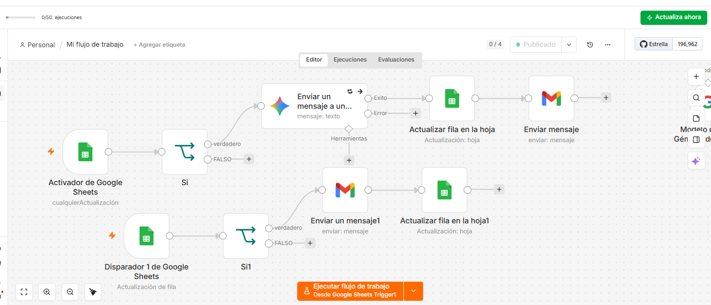
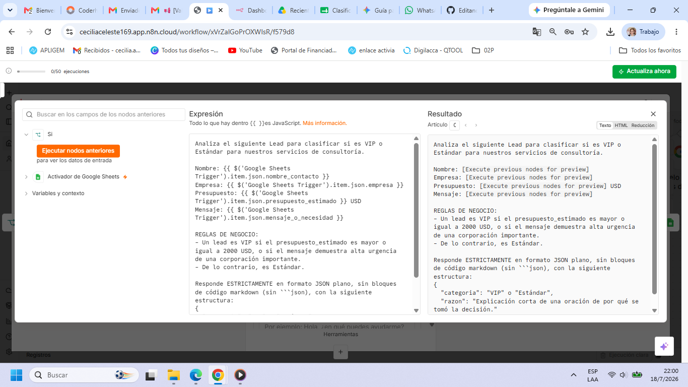
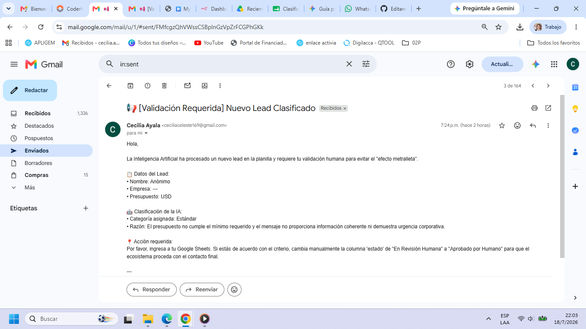
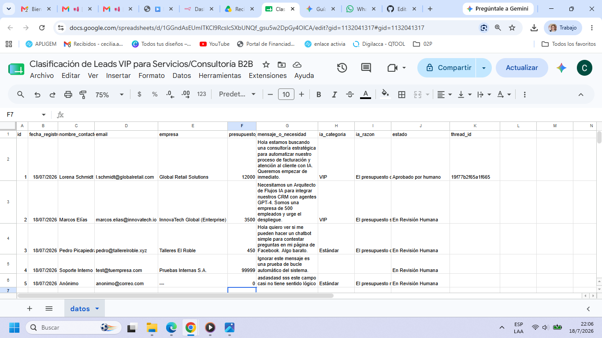

# Trabajo Final: Sistema Inteligente de Clasificación de Leads con IA y Control Humano

## 🚀 Enlaces Obligatorios de la Entrega
* **Base de Datos (Google Sheets):** [👉 HAZ CLIC AQUÍ PARA VER LA PLANILLA EN MODO LECTURA](TU_ENLACE_DE_COMPARTIR_GOOGLE_SHEETS_AQUÍ) *(Asegúrate de que cualquier persona con el enlace pueda leerlo)*
* **Lógica del Flujo (.json):** El archivo técnico de n8n se encuentra adjunto en la raíz de este repositorio como `flujo_clasificacion_leads.json`.
* **Diagrama de Arquitectura (PDF):** El documento explicativo formal se encuentra adjunto como `Diagrama_y_Especificacion_de_Arquitectura.pdf`.

---

## 📸 Evidencias del Flujo (Screenshots)
A continuación, se presentan las capturas de pantalla que demuestran el correcto funcionamiento del ecosistema automatizado de extremo a extremo:

### 1. Vista General del Flujo en n8n

### 2. Configuración del Nodo de IA (Prompt Engineering)

### 3. Mecanismo Human-in-the-Loop (Alerta Recibida)

### 4. Persistencia de Datos y Mapeo de Hilos (Thread ID)

## 🛠️ Tecnologías Utilizadas
* **n8n:** Orquestador central del flujo y control de estados.
* **Google Sheets:** Base de persistencia e integridad de datos.
* **Gemini / OpenAI API:** Motor cognitivo para análisis y justificación de leads.
* **Gmail:** Interfaz multicanal para alertas de control y comunicación con clientes.
